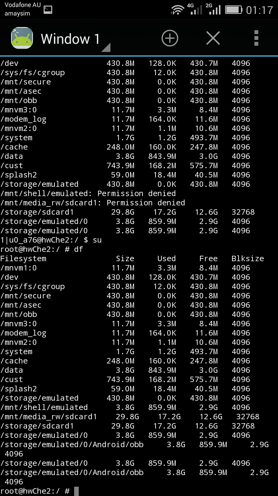

# 华为荣耀畅想4x 联通标配版(Che2-UL00 1G RAM) 刷机过程

## 连接手机

因为 Macbook 上做过 Android 开发，有 android tools，所以一开始直接连接 Macbook，打开 usb developer 中的 usb debugger，使用 adb devices 会发现已经连接上了，但使用 fastboot devices 则什么都没有，还以为在 Macbook 上不行。然后在 Windows 上尝试，一直连 adb devices 都没连接上，又是装轻量 android tools 驱动，又是装华为的驱动，最后还是装上华为助手才好像将驱动弄好连接上，但是还是 adb devices 连接上，fastboot devices 没有。

经过后面的尝试，得到的结论是：

- adb devices 在连接手机 debugger 打开就可以

- fastboot devices 要进入 fastboot 模式，电脑才显示出连接的设备。在手机连接状态下，使用 adb reboot bootloader 可以进入 fastboot 模式

## Recovery模式

### 默认 Recovery

* 手机默认带一个 Recovery，在关机状态，按着音量键上+开机键，见到 Logo 后松开开机键但还是按着音量键上，会进入。

- 手机默认的 Recovery 只能 update 华为提供的官方系统 Update 包，这种 Update 包后缀是 APP，要放在 SDcard 里根目录下的 dload/xxx.APP，然后可以在系统升级中『本地升级』来安装，也可以在关机状态下，按着音量键上和下+开机键，见到 Logo 后松开开机键但还是按着音量键上和下，会进入，自动安装 SDcard 位置的升级包。
- 手机默认的Recovery 不能安装卡刷包（即放在卡内的 zip 安装包），需要安装第三方 Recovery。

### 第三方 Recovery

* 找到一个华为荣耀畅想4x 联通标配版(Che2-UL00)的 recovery 实在太难了，网上一堆 Recovery 试过，刷进去了进不去 Recovery 模式，卡在开机处。
* 第三方 Recovery 有很多组织做，像 TWRP，CWMD 等。网上用了好多 TWRP 的 Recovery 都不成功，最后是使用 cofface 做的荣耀4X移动高配版(che2-tl00h)，但能用在标配上，这个 Recovery 是基于 CWM 版本改的，个人觉得超好用。
* 第三方 Recovery 提供`安装 zip 包`的功能，可以选择放在存储（内置或外置都可以）里的卡刷包，安装后就是刷新系统了。

### 卡刷包

* 一开始由于是官方的系统不能 Root，所以希望刷一个已经自带 Root 的系统。找到一个精简版的系统，这系统去掉一部分华为内置应用（但连 Google 服务都去掉了），而且在刷机包里提供一个 cwm recovery，这个 recovery 也是能用的。

  `【HRT_安晓主】4X移动联通标配版 B290 精简卡刷包 ROOT权限`

* 精简卡刷包去掉了 Google 服务，但自带 Root 权限，自带了 SuperSU 与 ReExplorer。

* 安装 Google 服务

  * 如果没用 google gms，即使装了 google play 这些也是会闪退的
  * google gms 不能随便乱装，不然装上后也会一直提示 service stop
  * 此处使用一个 app：rom installer，这个 app 提供安装google apps，会装上 google gms。其实就是下载了 gapps 的包，里面包含所有 google apps （此包可以选择 full, modular, mini）。安装此包的方式与安装卡刷包的方式一样，都是进入 Recovery 然后`安装 zip 包`选择安装。相当是要将 gms 刷进系统里

### 系统容量

* 装完卡刷包后，感觉与默认官方系统初始安装后剩下的容量差不多。从网卡查看得知，4x 说是 8G 内部存储，但实际在系统无论大小，都一定要占去4G，所以剩下3.77G 可以用，默认系统装了一些 app，所以会用掉200M~300M 左右的容量，剩下3.4G~3.5G。所以感觉精简版就多了那100M 容量。
* 既然精简版没比官方系统多释放容量，那还不如用官方系统，但官方系统没 Root，所以就想到 Root 官方系统

## Root 官方系统

* 官方系统一定要刷回官方的 Recovery，然后放到升级 APP 包在 SDcard 里，关机进入升级模式安装回去（方法见上）。
* Root 其实也是要刷机，目标是将 SuperSU 刷进系统。
  * 先刷进第三方 Recovery
  * 从网上下载[SuperSU](https://www.chainfire.eu/)，然后关机进Recovery，`安装 zip 包`选择 SuperSU 安装，重启后就已经 Root 成功了。

## Future

* 能不能修改手机的 partition，让系统不占用4G？
  * 目前已经手机分区：
    * /system: 接近1.8G
    * /dev: 431MB
    * /cust: 接近800MB
    * /cache: 250MB
    * /data and /storage 其实占用同一个 partition: 3.77G
    * 还有其它各种 log、mnvm、splash2 等也独自占有分区，但都比较小
  * 改变 storage->default location 从 internal storage 到 sd card，其实就将  /sdcard 本来指向 /storage/sdcard0 指向 /storage/sdcard1

## Partitions

* 装上 busybox 与 terminal，使用 df 命令查看 partitions

  

发现简直坑爹啊，终于知道4G 容量被哪占用了，/mn/下挂载了三个目录，/dev 目录，/sys/fs/cgroup 目录，都各自用掉430MB。

* 某些应用（例如 wechat, QQ, solidExplorer） 可以 Move to SDcard，移动完后发现只是将`/data/app` 里面的 apk，以前`/data/app-lib` 里面的库移动到`/mnt/asec/`下的相应目录，但`/data/data/`下面的应用 data 是不移动的，也就是说应用缓存还是占着。另一个坑爹的是，以为移动到`/mnt/asec/`下面就可以用那430MB，错了！其实是将一个目录挂载到`/mnt/asec/`下（如`/mnt/asec/com.tencent.mm-1`就是 wechat），但占用的空间确实是从 SDcard上取的，只不过入口在那里，所以你在 SDcard 是找不到的。怪不得 Move to SD card 后，手机连接电脑时应用就不能用了，因为其实确实是存在 SDcard 下了。

## Future Again

* 通过再次研究系统 partition，所以其实想到减少容量的方法：
  `使用 link 的方法`
* 将/data/data/里的应用数据移到 SDcard 或者那几个430MB 的存储位置，在原来地方创建 link。当然这样做需要有 root 权限，这就是能 root 的好处，以前 root 不了当然什么都实现不了。ß